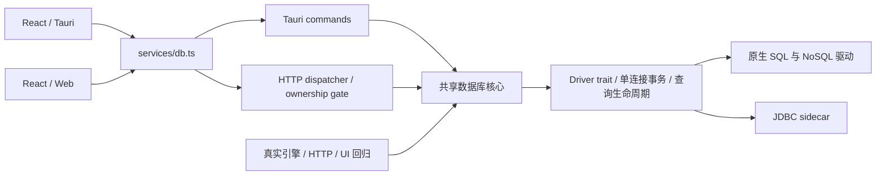

# Catio 数据库能力专项：DBX GAP 审计与验收

## 1. 基线与边界

- Catio 基线：`81f81b8`（0.7.3）；工作分支：`feat/dbx-database-parity`。
- DBX 参考：[`046ae4cfb4a3a4675886b721ccad0b05c77d1ec1`](https://github.com/t8y2/dbx/tree/046ae4cfb4a3a4675886b721ccad0b05c77d1ec1)。已通过浏览器读取 README，并浅克隆到被 Git 忽略的 `.worktrees/dbx-reference`。
- 范围：数据库连接、查询、事务、结果网格、元数据、数据操作、专用数据库浏览器及桌面/Web 一致性。保留 SSH/SFTP/MCP/Agent，不改现有生产部署或数据。
- 不把 DBX 的消息队列、Kubernetes、S3、LDAP 插件算作数据库 GAP；也不把 Catio 的 SSH/Agent 优势用来抵消数据库缺陷。
- 工作区已有 `src-tauri/gen/schemas/capabilities.json` 的用户改动，不覆盖、不提交。
- 文档中的“已有”仅表示发现代码入口，不等于通过实测。“超越”必须由明确场景与证据证明，不以引擎图标数量判断。

## 2. 已确认的 P0/P1 根因

| ID | 发现 | 代码证据（基线） | 影响 | 验收条件 |
|---|---|---|---|---|
| DB-01 | 原生分页 SQL 只取 limit 行，驱动只有读取第 limit+1 行才标记 truncated；TablePane 又丢弃 truncated | `db/driver.rs::paginated_query`、`db/dialect.rs::paginate`、`TablePane.tsx` | 页数/截断信息失真，允许继续翻到空页；部分查询分页不生效 | 205 行以 100 行分页为 100/100/5；200 行没有幽灵第三页；UI 能继续翻页 |
| DB-02 | 导入/覆盖迁移分别执行 BEGIN/写入/COMMIT，PG/MySQL 每次重新向池借连接 | `db/commands.rs::db_import_table/db_transfer_table`、`drivers/{postgres,mysql}.rs::query` | 假事务；部分成功、污染池中连接；覆盖失败可能丢原数据 | 单物理连接事务；第二批失败后旧数据完整保留；并发查询不混入事务 |
| DB-03 | 网格保存逐条执行，验证后面的请求之前已经写入前面的请求 | `db/commands.rs::db_apply_edits`、`server.rs` 同名分支 | 失败产生半提交；桌面/Web 两份逻辑漂移 | 全量预校验；事务引擎一次提交、任何错误整体回滚 |
| DB-04 | DuckDB/SQL Server 声明 transactions=true，但没有 exec_batch 实现 | `db/capabilities.rs`、`drivers/{duckdb,sqlserver}.rs` | Data Compare 执行承诺与运行时不符 | 声明的每种原生事务引擎均通过成功/回滚测试 |
| DB-05 | PG UUID 用 String 解码；ctid/枚举/数组/超范围 NUMERIC 解码失败直接 Null | `drivers/postgres.rs::pg_value_to_json` | 真值伪装为空，行编辑键无效，导出丢数据 | UUID、ctid、大 NUMERIC、数组、枚举、微秒时间无损；SQL NULL 仍为 null |
| DB-06 | 所有 PG 表/视图预览都 SELECT ctid，普通视图没有该列 | `db/driver.rs::table_data`、`commands.rs::db_table_query` | 浏览视图失败 | 普通视图可预览/筛选；只对安全可定位基表暴露行定位键 |
| DB-07 | SQL Server OFFSET/FETCH 缺 ORDER BY；JDBC 被一律拼 LIMIT；SQL 尾分号/已有 LIMIT 处理缺失 | `db/dialect.rs::paginate` | 多引擎分页语法错误 | 引擎正确的分页；已有 LIMIT 的查询不被放大；无多语句/写 SQL 重放 |
| DB-08 | “停止”仅使前端令牌失效，没有后端取消 | `SqlConsole.tsx::stop` | UI 显示停止，服务器还在执行 | 请求级取消 ID、可用引擎实际中断、生命周期清理；不能取消时不得宣称已中断 |
| DB-09 | MySQL 用户名/密码直接拼 URL | `drivers/mysql.rs::build_mysql_opts` | 含 @/:?#% 等的密码无法正确连接；错误可能包含连接串 | 分离选项与凭据，使用类型化 builder；特殊字符测试；不记录 secret |
| DB-10 | 结果切换/翻页不清理或阻止旧行号编辑；异步页请求无代际保护/错误处理 | `DataGrid.tsx::{gotoPage,changePageSize,refresh}` | 旧页修改可能被用在新页的其他行；竞态覆盖；未处理拒绝 | 未保存修改拦截分页/刷新；最新响应有效；失败可见且保留原页 |
| DB-11 | DML Null 键生成 = NULL；SQL Server 布尔/Unicode 无方言处理；MySQL 反斜杠字面量不安全 | `db/dml.rs` 及导入/导出/迁移共用值生成 | 匹配失败、错误值、转义失效 | 各方言 roundtrip；NULL/空串/布尔/引号/反斜杠/中文无损 |
| DB-12 | 表导入仍按 capabilities.schemas 过滤 MySQL 库名；Web 未暴露导入/迁移/SQL 文件 | `commands.rs::db_import_table`、`services/db.ts`、`server.rs` | 写错默认库/桌面 Web 不一致 | 非默认库写入实测；Web 使用受控字节接口而非任意服务器文件路径 |

## 3. 能力矩阵（固定参考版本与基线差距）

DBX 路径均相对于上述固定参考仓库。下表记录改动前的 GAP，**本轮完成情况与证据见第 6 节，剩余差距见第 7 节**。`待验证` = 不能只凭已有入口计为对齐。

| 能力域 | DBX 实现/证据 | Catio 基线 | GAP / 优先级 |
|---|---|---|---|
| 常用 SQL 引擎 | native driver crates + `crates/dbx-core/src/query` | 10 个原生协议驱动 + JDBC | 主流路径有严重正确性 GAP，P0 |
| 长尾/国产/云数据库 | 驱动 Agent/配置、100+ 声明 | 协议族 + JDBC profiles | 按引擎核验，不能仅新增名称就算支持，P2 |
| SSL/高级选项 | connection、driver 配置 | 多数原生已有；PG options 未消费 | 连接字段与实际驱动一致，P1 |
| SSH/代理连接 | connection transport | SSH/隧道已有 | 本次不重写既有 SSH 域；数据库链路验证待补 |
| 查询编辑器 | `apps/desktop/src/stores/queryStore.ts` | CodeMirror、补全、格式化、选中执行已有 | 方言传递/多结果/状态反馈待验证，P1 |
| 查询取消/超时 | `crates/dbx-core/src/query/query_cancel.rs` | 前端停止等待 | 后端请求级取消缺失，P1 |
| 手动事务 | query sessions、transaction tests | 池化任意 query，不保证会话粘性 | 缺 session-scoped 事务契约，P1 |
| 自动原子批量写 | `query::execute_statements_in_transaction_on_pool` | 仅 PG/MySQL/SQLite exec_batch | 补齐驱动并统一写入编排，P0 |
| 多语句/多结果 | queryStore multiStatement tests | 控制台整个文本走单 result | 功能 GAP，P1 |
| 数据网格分页 | `lib/query/queryPaginationResult.ts` | 一页、has-more 丢失 | DB-01/07，P0 |
| 网格编辑安全 | `useDataGridEditor.ts`、`useDataGridResultLifecycle.ts` | PK/ctid + DML 预览 | 跨页脏编辑与部分提交风险，P0 |
| NULL/默认值/空串编辑 | grid editor | input string；新行过滤空字符串 | 类型与空值语义 GAP，P1 |
| 服务端筛选/排序 | dataGrid filter/sort composables | WHERE/ORDER BY + 本地结构化筛选 | 结构化筛选可能只筛当前页；清楚标注并补齐，P1 |
| 网格大结果性能 | grid runtime/canvas + virtualization | 页内 DOM grid | 真正的虚拟化/性能度量待补，P2 |
| 元数据/库树 | schema providers/object cache | eager 全库枚举、失败吞为空 | 容错可见、分层懒加载，P1 |
| 视图/函数/过程源 | schema/object editor | 有对应组件与接口 | JDBC/SQLite 路径完整性待验证，P1 |
| 表结构修改/DDL | `schema/table_structure_sql.rs`、SQLite rebuild | structureDdl.ts + SQL 执行 | 原子 DDL/复合约束/重建策略 GAP，P2 |
| ER/schema diff | schema、前端图形与 diff | 已有组件 | 不以 mock 冒充 live，真实关系回归待补 |
| 数据比较/同步 | `data/data_compare.rs` | compareTables + exec_batch | 事务/数据上限与截断告警，P1 |
| 执行计划 | queryStore *Explain tests | PG/MySQL JSON EXPLAIN | SQL Server/Oracle 等 GAP，P2 |
| 字段血缘/对象搜索 | frontend lineage/search | 已有前端实现 | 准确性/跨方言仍需场景验证 |
| CSV/Excel 导入 | `data/table_import.rs` | 桌面已有 | 真事务/选库/Web GAP，P0/P1 |
| 数据迁移 | `data/transfer.rs` | 桌面已有，Web 缺 dispatcher | 原子性、同源同目标保护、双连接权限隔离，P0 |
| 数据库导出 | `data/database_export.rs` | 累计全量内存后返回文本 | DDL 保真/流式/类型正确性，P1/P2 |
| SQL 文件执行 | `data/sql_file_import.rs` | 桌面已有、逐语句取消 | Web/当前语句取消 GAP，P1 |
| Mongo 文档 CRUD | `query/mongo_ops.rs`、document_ops | shell 控制台；预览只读 | 专用文档编辑与类型保真，P1 |
| Redis | `query/redis_ops.rs` | 类型编辑、TTL、命令已有 | Stream/批量操作/大 key 有界读取待核验，P2 |
| Elasticsearch | native/document browser | REST/SQL + 预览 | 索引/文档编辑、错误处理待核验，P2 |
| DuckDB 文件预览 | file preview flow | 驱动支持，缺拖入入口 | Parquet/CSV/JSON 文件入口 GAP，P2 |
| 连接迁入 | import DBeaver/Navicat | `ImportConnectionsModal.tsx` 已有 DBeaver/Navicat 导入 | 保留；不能算作本轮新增能力，尚未逐格式实测 |
| 定时备份 | `crates/dbx-core/src/scheduled_backup` | 未找到数据库备份调度 | GAP，P2 |
| MCP/Agent | `ai/mcp_policy.rs` | Catio 既有能力保留 | 不改协议；数据库核心修复应惠及调用方 |

## 4. 实施顺序与质量门禁

### 阶段 A：先保证不会写错/丢数据

1. 新建真实回归：分页、原子保存/导入、非默认数据库、特殊字符、PG 类型。
2. 桌面/Web 复用数据库核心，而非在 dispatcher 复制业务逻辑。
3. 实际事务固定一个物理连接，失败回滚；覆盖操作在源数据准备好后才修改目标。
4. Grid 请求代际、脏编辑保护、失败保留原结果、NULL 与空串区别。

### 阶段 B：查询与引擎一致性

1. 正确的 N+1 分页、SQL Server/PG 视图/JDBC 方言。
2. PostgreSQL 结果有界流式读取，所有已返回值不能因未知类型伪装 NULL。
3. 查询执行 ID、取消、超时及 terminal 状态；连接断开清理；同连接不同 tab 不相互取消。
4. MySQL typed options 与 TLS 参数；元数据在实连失败时不回退 demo 表。

### 阶段 C：数据操作和可见的功能缺口

1. Web 导入/迁移共用安全核心，上传只接受有界字节，不允许浏览器指定服务器路径。
2. JDBC 元数据、类型与事务、SQL 文件和多结果操作；如改 Java 必须重建 vendored JAR。
3. 优先补齐主流数据库的可用场景；长尾引擎、云凭据不足等明确记为未验收。

### 测试与交付

- Frontend baseline：122 files / 1,061 tests 通过。
- Rust DB baseline：330 tests 通过（仅 `--lib db::`，不表示真实引擎测试通过）。
- 专用沙箱：独立 `catio-db-lab` 目录/容器标签，不使用生产 profile/密钥/卷。
- 测试分级：纯函数、嵌入式 SQLite/DuckDB、真实 PostgreSQL/MySQL/SQL Server/MongoDB/Redis/HTTP 引擎、HTTP 权限隔离、浏览器交互、完整前端及后端回归。
- 对每个失败场景保存 red/green 证据；默认环境无数据库时跳过，沙箱验收必须显式启用 env gate，并报告实际执行数。
- 小粒度中文语义化 commits；不提交下载的 DBX 源码、数据库数据、安装包、日志、测试 secret。

## 5. 架构约束

扩展点：新增引擎必须实现 Driver + 能力契约 + env-gated 实测；新增 RPC 必须同时注册桌面及 Web 路由并覆盖权限隔离；新增数据操作复用事务编排，禁止用独立池化 query 拼装事务；新增 UI 复用 token/i18n，不显示未经验证的成功/取消状态。

## 6. 最终验收记录

### 已落地的实现

| 方向 | 本轮实现 | 主要代码 / 测试证据 |
|---|---|---|
| Windows DuckDB 稳定性 | MSVC C++ 开启 `/EHsc`，失败事务后不再因未展开的异常锁住连接；不是跳过用例 | `.cargo/config.toml`；`db_duckdb_transaction_regression.rs` 的最小原生复现与回归 |
| 原子写入 | 单连接事务、预校验全部编辑、SQL 错误回滚；MySQL 覆盖使用 DELETE；非事务表提前拒绝原子替换 | `write_ops.rs`、`Driver::exec_statement_batch`；`db_parity.rs`、`db_extended_parity.rs` |
| 数据迁移 | 先将源数据暂存，再修改目标；落盘预算含 JSON 转义开销、同连接复制、目标事务、失败保留原目标；歧义 hex/BLOB 在写目标前拒绝 | `write_ops::transfer_table`；同连接、目标失败、二进制保守拒绝及暂存预算测试 |
| 分页 | N+1 哨兵、准确末页、保留原 LIMIT、拒绝写语句/多语句重放、SQL Server 分页、JDBC 游标跳过前缀 | `pagination.rs`、`driver.rs`、JDBC `offsetRows`；205/200 行边界测试 |
| 查询生命周期 | 请求 ID、原生中断/超时、早到取消、断开清理；PG/MySQL 固定控制台物理会话保留临时表/显式事务 | `query_control.rs`、`manager.rs`、原生驱动；`db_query_control.rs`、`db_extended_parity.rs` |
| 查询工作台 | 多语句顺序执行、多结果切换、遇错/停止不再执行后续语句、可选结果上限、不会自动重放 DML | `SqlConsole.tsx`、`db_split_query`；`SqlConsole.execution.test.tsx` |
| 网格可信性 | 脏编辑拦截翻页/刷新、请求代际保护、失败保留旧页、NULL 与空串区分、无键表允许插入但不更新 | `DataGrid.tsx`；`DataGrid.safety.test.tsx` |
| 查询同名列 | JOIN/表达式重名列按位置保留，生成可见且不碰撞的别名，避免串值及 JSON 导出覆盖 | `gridColumns.ts`；同名列与保留已有后缀测试 |
| 真实状态反馈 | 真实连接不再显示演示 localhost:5432 / 12 ms；首批预览行数不冒充整表总数 | `SchemaBrowser.tsx`、`TablePane.tsx`；TDD red/green 及浏览器复验 |
| SQL 复制安全 | 无稳定键不生成无 WHERE 的 UPDATE；按引擎处理引号、反斜杠、SQL Server Unicode/布尔；无明确目标的查询结果不虚构 orders 表 | `copySql.ts`、`dml.rs`；`gridColumns.test.ts`、`copySql.test.ts` |
| 类型保真 | PG UUID/NUMERIC/微秒时间；SQL Server GUID/DECIMAL(38,s)；DuckDB 直接解码 Arrow，避免 96-bit Decimal 中间类型溢出；JDBC 数字保真 | 各原生驱动、`result.rs`、Java `readValue`；原生/嵌入式回归 |
| JDBC 补齐 | 动态事务能力、单连接批处理、索引/复合索引/外键/ER、结果列类型、分页、忙碌 sidecar 可断开 | `jdbc.rs`、`CatioJdbcPlugin.java`；Java 与 Rust H2 端到端测试；已重建 JAR |
| HTTP 数据库 | HTTP 引擎遵守 SSL/CA 配置；ClickHouse 保留默认库、消费并检查完整响应、不把 200 当作无条件成功、精确数字输出 | `drivers/http.rs`、`clickhouse.rs` 等；`db_http_parity.rs` |
| Web 补齐 | 有界文件字节导入，不接受任意服务器路径；迁移复用桌面核心；源与目标连接都验证所有权 | `server.rs`、`TableImportDialog.tsx`；`server_database_workflows.rs` |
| 原有能力 | 不重写 SSH/SFTP/Agent/MCP。仅更新一处过时的 SSH 测试 import，以恢复现有测试编译 | `ssh_sysinfo.rs` 的 test-only import；前端全量及后端回归 |

### 验收结果

| 验收层 | 实际结果 | 本地证据（忽略目录，不提交原始日志） |
|---|---|---|
| 前端全量 | **125 files / 1,085 tests，全部通过** | `.worktrees/dbx-parity-logs/frontend-final-3.log` 与 `.exit` |
| TypeScript / 生产前端构建 | `npx tsc --noEmit`、`npm run build` 通过 | `build.log`、`build-final.log` |
| Rust library | **527 tests，全部通过**；含数据库及原有其他域单元测试 | `database-matrix-release.log` |
| 数据库 / HTTP / MCP 集成 | **21 个明确 test targets / 95 tests，全部通过**；服务 env gate 与 TLS 均启用 | `database-matrix-release.log` 与 `.exit = 0` |
| 保留能力集成回归 | **8 targets / 53 tests，全部通过**；SSH 连接/终端/隧道/sysinfo、SFTP 后端/传输/HTTP、Agent policy | `preserved-capabilities.log` 与 `.exit = 0` |
| Java / H2 | **4 tests，全部通过**；vendored JAR 已按流程重建 | `src-tauri/jdbc-plugin/target/surefire-reports/app.catio.jdbc.CatioJdbcParityTest.txt`；JAR SHA-256 见下 |
| 可见浏览器 | 真实 Rust Web 后端 + SQLite，不使用 mock；多结果、分页、编辑、CSV、错误中止、取消、主题/i18n 已验收 | `browser-acceptance.json`、`ui-light-multi-results.png`、`ui-dark-multi-results.png`、`ui-grove-en-multi-results.png` |

真实服务矩阵为 **PostgreSQL 16、MySQL 8、SQL Server 2019、ClickHouse 24.8、MongoDB 7、Redis 7、Elasticsearch 8.15、rqlite 8.36**，另含嵌入式 SQLite/DuckDB 及 JDBC/H2。旧内核上的 SQL Server 2022 启动失败已保留为不兼容观察，不将 2019 的通过写成 2022 已通过。TLS 使用临时测试 CA 实际验证，没有关闭证书校验。

21 个 targets：`db_postgres`、`db_mysql`、`db_sqlserver`、`db_clickhouse`、`db_mongo`、`db_redis`、`db_elasticsearch`、`db_rqlite`、`db_sqlite`、`db_duckdb`、`db_dml_roundtrip`、`db_jdbc_h2`、`db_parity`、`db_extended_parity`、`db_query_control`、`db_duckdb_transaction_regression`、`db_http_parity`、`server_db`、`server_database_workflows`、`server_isolation`、`server_mcp`。不能把默认未设置 env 而提前返回的 `ok` 当作真实引擎验收；上述最终矩阵使用 runner 显式设置服务 env。

浏览器关键观察：

- 4 条 SQL 顺序执行，分别保留结果；`SELECT 11 AS id, 22 AS id` 显示两列 `11 / 22`。
- 205 行分页为 **100 / 100 / 5**，末页禁用下一页；编辑期间分页/刷新被保护。
- 修改第 201 行，SQL 预览含正确主键 WHERE；保存影响 1 行，刷新仍保留修改。
- CSV 追加两行中文数据后总数为 **207**；先清空模式缺少表名确认时不能提交。
- 失败 SELECT 后的 INSERT 不执行；取消长递归查询收到后端 `query cancelled`，随后新查询正常，COUNT 仍为 207。
- 修复后重新构建/加载，连接栏显示真实 profile 名；表头只显示真实列数，不把首批 100 行冒充总数。
- Dawn、Amber、Grove 三主题及中英文新控件可读。既有英文侧栏分类文字在固定宽度下仍有截断，不宣称完成所有响应式布局优化。
- 这是 Web UI 的真实端到端验收，**未执行打包后的 Tauri 桌面 GUI 全量回归**。最终二进制迁移保护和暂存预算补丁由之后的 Rust 矩阵覆盖，不冒充已由此前运行中的浏览器后端验证。

构建仍有既有的前端大 chunk 提示与少量 Rust test-only 未用变量提示，不将“命令成功”写成“零 warning”。JAR SHA-256：`D2BDB693F75D4F86B1AFF7BB674FDE408A2A7ECB95D4D88DD27CF6B47B69A8FC`。

## 7. 距离“数据库能力全面强于 DBX”仍然存在的差距

**结论边界：本轮是核心可靠性与高频工作流的实质性补齐，不是所有数据库/所有工具的完全超集。** Catio 当前 `DB_ENGINES` 有 57 个可选目录项、11 个协议族；目录项和兼容协议不等于逐引擎实测。DBX 的 100+ 宣传还包含中间件/插件；不以两者名称数直接评分。

1. **二进制/复杂类型通用写回**：现有结果协议把部分二进制显示为 hex 文本，不能无条件当作原始键或 SQL 字符串写回。已阻止不安全的 hex 行键/网格二进制编辑；迁移遇到映射列中的 hex/BLOB 歧义值会在修改目标前拒绝（纯文本恰好符合 `0x…` 格式也保守拒绝，可跳过该列或使用原生工具）。完整 typed-value 协议、BLOB 编辑/迁移/SQL 导出仍需补齐。
2. **元数据与 DDL 全保真**：分层懒加载、逐命名空间错误可见性、完整精度/长度/生成列信息、复合约束/依赖排序、SQLite 重建、SQL Server/长尾引擎结构编辑等，尚未逐项完成对标。不要把现有 structureEdit 开关当作所有 DDL 均已验收。
3. **连接/事务治理**：现在是连接级 SQL 会话；按 tab 隔离的手动事务、事务状态 UI、会话过期策略和可审计重连仍有差距。网络在 COMMIT 确认阶段失败时结果可能不确定，不自动重试写入。
4. **取消范围**：SQL Server、JDBC 的单条 Statement 中断、HTTP 引擎原生取消，以及导入/迁移任务级取消/恢复仍需实现；JDBC 目前可通过断开终止进程。不能把取消请求等同于已回滚。
5. **数据网格规模与查询工具**：虚拟化/画布性能、所有引擎的服务端结构化过滤/排序、跨页全量导出、更多 EXPLAIN 可视化与稳定大表数据比对仍需专项回归。
6. **专用数据库体验**：MongoDB 保真文档编辑器、Redis Stream/批量管理、Elasticsearch 索引/文档管理、向量数据库等，对照 DBX 仍有明确缺口。
7. **高级数据工具**：原生备份恢复/定时备份、跨库一致性快照、超大 SQL 文件的 Web 执行和可恢复任务、DuckDB 拖入 Parquet/CSV/JSON 预览等，不能算本轮已经完成。
8. **商业、国产及云引擎**：Oracle/达梦/DB2/Snowflake/BigQuery 等需要具体版本、驱动许可及真实实例验证。H2 的通过不代表这些产品已经全部验证；协议族变体也需要方言级验收。
9. **Web 信任边界**：多用户资源 ID 隔离已覆盖，但可执行数据库 SQL 的 Web 服务不是 OS 级沙箱。尤其是嵌入式数据库与 JDBC，只应向可信用户开放，不能把普通登录隔离描述为对恶意 SQL/本地文件访问的完整隔离。

这些条目保留为未完成目标，而不是用已存在的 SSH/Agent 优势替代数据库差距。没有把它们擅自创建为任务管理器中的长期任务。

## 8. 工程评分（审计判断，不是 DBX 性能排行榜）

以下只评价本轮后的数据库子系统工程状态，每项 10 分；未验证的能力不按完成计分。

| 维度 | 分数 | 可追溯依据与剩余问题 |
|---|---:|---|
| 架构清晰度 | 7 | Driver/共享 write_ops/双传输入口边界明确；DTO 仍与 commands 耦合，需要继续拆分 |
| 可扩展性 | 8 | StatementBatch、query_cancellable、typed decoder 提供扩展点；长尾方言仍需逐一落地 |
| 可维护性 | 6 | 补丁集中于数据库域并补相邻测试；DataGrid/SqlConsole/dispatcher 仍偏大 |
| 可靠性 | 8 | 原生失败回滚、真实取消、早到取消与边界分页有回归；网络提交不确定性/恢复任务尚未闭合 |
| 可观测性 | 6 | 执行 ID、错误传播、脚本结果列表与测试日志；长任务阶段进度/统一 tracing 仍不足 |
| 文档质量 | 8 | 固定参考版本、GAP 矩阵、复现环境、明确限制与离线 HTML；尚需长期维护的产品兼容表 |
| 示例与教程 | 7 | Compose、一次性 runner、TLS 夹具及 loopback QA head；不覆盖商业数据库搭建 |
| 测试与 CI | 8 | 全量前端、原生/嵌入式/HTTP/JDBC 回归；数据库矩阵尚未完整接入常规 CI |
| 安全与配置 | 7 | 转义、TLS、连接所有权、非事务目标拒绝；Web SQL 沙箱和历史脱敏仍需专门设计 |
| 开发体验 | 8 | strict TypeScript、可重复夹具、已修正 MSVC 构建、JAR 同步；首轮原生构建仍重 |
| **总分** | **73 / 100** | **审计性评价，不代表“已经全面超过 DBX”或测试覆盖率百分比。** |

## 9. 数据与交付边界

- 未部署/重建 vibe 服务，未接触其数据卷、环境文件或 master key。
- 原有 `capabilities.json` 用户改动以 SHA-256 核对并备份，不纳入本次提交。
- SQL 历史仍按原机制持久化；本轮没有新增向模型发送查询结果的路径。文件导入字节发送到当前认证服务器，不按用户给出的任意服务器路径读盘。
- 数据库容器/临时 CA 仅用于沙箱；私钥、env、下载的参考仓库、Maven、运行日志留在忽略目录，不提交。
- 收尾已停止 `99-sandbox` 上所有 `catio-db-lab` 项目的运行容器，未删除容器或数据卷；删除本轮为开发机添加的 59201/54002/59443 三条 runtime firewalld 规则。独立 Docker 工具/服务、测试镜像与 `/opt/catio-db-lab` 保留供复跑。
- 本地 QA 浏览器页面已关闭，18877 端口已确认没有监听；测试记录和三主题截图保留在忽略目录。
- 网络提交失败、并发源数据变化、二进制备份等边界已明确，不宣称绝对或全场景的数据安全保证。

## 10. 代码提交

| Commit | 逻辑变更 |
|---|---|
| `85389fb` | JDBC sidecar 事务/元数据协议、H2 回归与内置 JAR |
| `1a3c4ec` | 数据库核心读写契约、分页、类型保真、查询生命周期及集成测试 |
| `022f37a` | 工作台多结果、安全编辑、Web 导入、主题/i18n 与前端回归 |
| `08de4c3` | 隔离数据库实验室、浏览器验收入口及 SSH 测试引用修正 |

本报告与离线 HTML 单独作为文档提交。本轮未合并到 `main`、未推送远端，也未发布桌面安装包。
