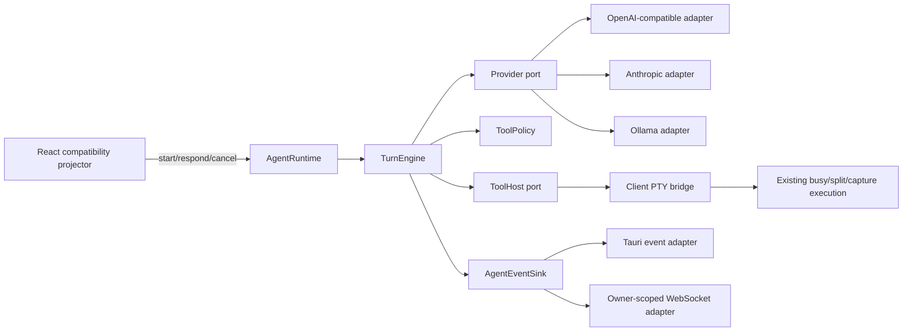

# Catio Agent Rust Turn Engine 设计

> 日期：2026-08-15  
> 状态：设计讨论已确认，书面设计待用户复核  
> 关联研究：[`small-rust-hermes-v3-analysis.md`](../../research/small-rust-hermes-v3-analysis.md)  
> 领域语言：[`CONTEXT.md`](../../../CONTEXT.md)

## 1. 目标

在保留 Catio 当前 Agent 面板、conversation、流式 Markdown、权限弹窗和 terminal split 体验的前提下，将 provider streaming、typed tool loop、审批状态、取消和 ordered events 收敛到 UI 无关的 Rust `AgentRuntime`。

本阶段交付研究文档中的 P0 最小闭环：

- provider-neutral `AgentMessage`、`ContentBlock`、`ToolUse` 与 `ToolResult`；
- OpenAI-compatible、Anthropic、Ollama provider adapters；
- Rust `TurnEngine` 与 typed UI event stream；
- 第一个 structured tool：`terminal_exec`；
- 保留现有 PTY busy、split 和 capture 行为的 client `ToolHost` bridge；
- desktop 与 server mode 复用同一个执行内核；
- 不支持 native tools 时仍经过相同 invariant 的显式 legacy fallback；
- React 只提交请求、用户决策和工具结果，不再拥有 tool loop 状态机。

## 2. 非目标

P0 不实现以下内容：

- typed transcript 或 event 持久化；
- engine-level per-conversation mutex 和 resource lease；
- 能证明远端进程已经终止的 cancellation；
- DB tools；
- Skills、Memory、Reflection 或 Skill Evolution；
- goal loop、subagent 或自主任务完成 marker；
- Agent 页面重做、tool card 或新的导航页面；
- API key 的新持久化方案。

这些能力分别属于研究文档中的 P1–P4。P0 可以预留不泄漏实现细节的类型位置，但不得提前实现这些阶段的产品行为。

## 3. 已确认的架构决策

1. 采用 Catio 自有 Rust module，不直接依赖整个 Hermes workspace。
2. `AgentRuntime` 是对 desktop、server 和测试暴露的唯一深 module。
3. Rust 负责 provider、tool loop、policy、事件顺序和取消状态。
4. 生产 `ToolHost` 使用 client execution bridge，复用当前 PTY 执行能力。
5. `owner_id` 由可信 transport adapter 注入，不能由前端请求指定。
6. UI-facing events 与 provider wire events 分层，前者保持稳定。
7. legacy Markdown command 先转换为 synthetic `ToolUse`，不得建立第二套执行循环。
8. 缺失审批通道时 fail-closed。
9. API key 仅在本 Turn 的内存中使用，不进入 event、日志或持久化。
10. desktop 与 server 对相同 scripted fixture 产生相同 ordered events。

## 4. 领域语言

Catio 已经使用 `sessionId` 表示活跃 SSH session，因此 Agent runtime 不使用含混的 Agent Session。核心标识为：

- `Conversation`：可持久化、UI 可见的交互线程。
- `Turn`：一次用户提交及其触发的全部 provider/tool rounds。
- `ToolUse`：尚未产生副作用的结构化工具意图。
- `Approval`：针对单个 `ToolUse` 的允许或拒绝决策。
- `ToolResult`：与一个 `ToolUse` 唯一配对的终态结果。
- `TargetRef`：SSH PTY、本地终端或后续数据库连接的稳定引用。
- `OutcomeUnknown`：已停止等待或请求取消，但无法证明目标侧副作用已停止。

完整定义以仓库根目录 `CONTEXT.md` 为准。

## 5. 总体架构



依赖分类：

- Provider 是 true external dependency，通过 `Provider` port 注入，测试使用 scripted adapter。
- desktop/server event delivery 是 owned transport dependency，通过 `AgentEventSink` adapters 复用同一事件实现。
- PTY execution 是 Catio 自有、跨 client/server transport 的能力，通过 client `ToolHost` adapter 接入。
- turn 状态、event sequencing 和 message aggregation 是 in-process dependency，全部隐藏在 `AgentRuntime` 内。

删除 `AgentRuntime` 后，这些复杂度会重新散落到 React、provider parser、server dispatch 和 terminal execution 调用点，因此该 module 具备足够深度和 locality。

## 6. `AgentRuntime` interface

对外 interface 控制为三个入口：

```rust
impl AgentRuntime {
    async fn start_turn(
        &self,
        actor: ActorContext,
        request: StartTurnRequest,
        events: Arc<dyn AgentEventSink>,
    ) -> Result<TurnHandle, AgentError>;

    async fn respond(
        &self,
        actor: ActorContext,
        turn_id: TurnId,
        response: ClientTurnResponse,
    ) -> Result<(), AgentError>;

    async fn cancel(
        &self,
        actor: ActorContext,
        turn_id: TurnId,
    ) -> Result<(), AgentError>;
}
```

`ClientTurnResponse` 只有两类：

```rust
enum ClientTurnResponse {
    ApprovalDecision {
        tool_use_id: ToolUseId,
        decision: ApprovalDecision,
    },
    ToolExecutionResult {
        tool_use_id: ToolUseId,
        outcome: ToolExecutionOutcome,
    },
}
```

interface invariant：

- server adapter 从 authenticated `User` 构造 `ActorContext`；desktop adapter 构造固定 local actor。
- `respond` 与 `cancel` 必须验证 actor 是 Turn owner。
- `respond` 只能解析当前状态正在等待的 response kind 和 `tool_use_id`。
- Turn 仍处于 active registry 时，相同 response 重放为幂等 no-op；内容冲突的第二次 response 返回明确错误。
- terminal event 发出并移除 active Turn 后，后续重放统一返回 completed/not-found 类错误，不能重新激活 Turn。
- `TurnHandle` 只返回 opaque `turn_id` 和必要的订阅信息，不泄漏内部 channel 或 provider 类型。

## 7. 核心类型

```rust
enum ContentBlock {
    Text { text: String },
    Thinking { thinking: String },
    ToolUse { id: ToolUseId, name: String, input: Value },
    ToolResult(ToolResult),
}

struct AgentMessage {
    role: AgentRole,
    content: Vec<ContentBlock>,
}

struct ToolSpec {
    name: String,
    description: String,
    input_schema: Value,
}

struct ToolResult {
    tool_use_id: ToolUseId,
    content: String,
    status: ToolResultStatus,
}

struct ToolExecutionOutcome {
    content: String,
    status: ToolExecutionStatus,
}

enum ToolExecutionStatus {
    Succeeded,
    Failed,
    Blocked,
    Cancelled,
    OutcomeUnknown,
    Unsupported,
}

enum ToolResultStatus {
    Succeeded,
    Failed,
    Denied,
    Blocked,
    Cancelled,
    OutcomeUnknown,
    Unsupported,
}
```

P0 的 `terminal_exec` input schema 至少包含 `command`。目标引用来自受信任的 `StartTurnRequest.target_ref`，模型不得通过 tool input 任意选择其他 owner 或 connection 的目标。

`ToolExecutionOutcome` 是 client `ToolHost` 的事实回报，不允许 client 构造 `Denied`；审批拒绝只由 engine 生成 `ToolResultStatus::Denied`。Engine 使用等待中的 `tool_use_id` 校验 response，再构造唯一的内部 `ToolResult`。

历史 conversation 在 P0 仍以 user/assistant 文本快照进入 engine；本 Turn 内的 tool blocks 保持 typed。P2 持久化前，不改变当前 conversation 的存储格式。

## 8. Event envelope 与事件协议

```rust
struct AgentEventEnvelope {
    owner_id: OwnerId,
    conversation_id: ConversationId,
    turn_id: TurnId,
    sequence: u64,
    event: AgentEvent,
}
```

UI-facing `AgentEvent`：

- `TurnStarted`
- `AssistantMessageStarted { message_id, round }`
- `TextDelta { message_id, delta }`
- `ThinkingDelta { message_id, delta }`
- `AssistantMessageFinished { message_id }`
- `ToolProposed { tool_use_id, name, input, risk }`
- `ApprovalRequested { tool_use_id, reason }`
- `ToolExecutionRequested { tool_use_id, target, input }`
- `ToolStarted { tool_use_id }`
- `ToolOutputDelta { tool_use_id, delta }`
- `ToolFinished { tool_use_id, result }`
- `UsageUpdated { input_tokens, output_tokens }`
- `CompatibilityFallbackActivated { provider, reason }`
- `TurnFinished`
- `TurnCancelled`
- `TurnFailed { code, message }`

`ThinkingDelta` 与 `ToolOutputDelta` 在 P0 可以没有生产者或被 projector 忽略，但类型从第一版固定。Provider-specific SSE/NDJSON chunks 不得穿透到该协议。

事件 invariant：

- `sequence` 在单个 Turn 内严格递增。
- 每个 Turn 恰有一个 terminal event。
- terminal event 是该 Turn 的最后一个 event。
- 每个 `ToolUse` 恰有一个 terminal `ToolResult`。
- 未获得 policy authorization 前不能产生 `ToolExecutionRequested`；`ask` 的敏感命令需要显式 Allow，`ask` 的普通命令和 `auto` 由 policy 产生隐式 Allow。

## 9. Turn 生命周期

### 9.1 启动

前端先建立 `agent://events` 订阅，再调用 `start_turn`。`StartTurnRequest` 携带：

- `conversation_id` 和 prior user/assistant messages；
- system prompt、sysinfo 和 terminal context 的不可变快照；
- provider、model、base URL 和仅供本 Turn 使用的 credential；
- `TargetRef`；
- execution mode、single-line 限制和 round cap。

`owner_id` 不属于前端 payload。`AgentRuntime` 生成不可预测的 `turn_id`，注册 response/cancel routing，发出 `TurnStarted` 后异步运行 engine。

### 9.2 Provider round

Engine 构造 provider-neutral request，由 adapter 编码 wire format。Streaming 期间：

- text/thinking delta 转换为稳定的 UI events；
- tool input fragments 只在 adapter 内累积；
- assistant message 完成后才把完整 typed blocks 加入本 Turn history；
- stop reason、usage 和协议结束标记由 adapter 规范化。

没有 tool call 时，engine 发出正常的 assistant/turn terminal events。存在 tool calls 时，engine 逐个验证名称和 input，并为无效调用生成 error `ToolResult`，不得执行未知工具。

### 9.3 Policy 与审批

execution mode 保持当前产品语义：

- `manual`：不向 provider 暴露 `terminal_exec`，也不解析 legacy command。
- `ask`：普通命令可执行；敏感命令等待 `ApprovalDecision`。
- `auto`：不等待敏感命令审批，但仍受 target availability、PTY busy/split 和 capture 约束。

当前 TypeScript 敏感命令规则迁移到 Rust `ToolPolicy`，并使用共享 fixtures 验证迁移前后分类一致。审批 sender 缺失、等待超时或响应 owner 不匹配时一律 fail-closed。

### 9.4 Client ToolHost bridge

允许执行后，生产 `ToolHost`：

1. 发出 `ToolExecutionRequested`；
2. event sink 成功接受 dispatch 后发出 `ToolStarted`；该事件只表示 bridge 已进入 dispatched state，不证明目标进程已启动；
3. 等待匹配的 `ToolExecutionResult`；
4. 前端复用现有 `executeAgentCommand` 完成 busy 检查、split 询问、PTY 写入和 capture；
5. 前端把结构化 terminal outcome 提交给 `AgentRuntime.respond`；
6. Engine 生成唯一配对的 `ToolResult` 并继续 provider round。

split permission 属于 client PTY adapter 的资源协调结果，不成为第二套 Agent approval。拒绝 split、target 已关闭或 capture 不可用都以 typed `ToolResult` 返回 engine。

### 9.5 拒绝、round cap 与结束

用户拒绝时仍产生 `ToolResult::Denied`。为避免模型反复申请同一命令，engine 随后只允许一次 tools-disabled final synthesis。

达到 round cap 时同样只允许一次 tools-disabled synthesis；该 synthesis 失败则 `TurnFailed`。正常完成、取消和失败分别只发出一个 terminal event，并清理所有 waiters 与 active turn state。

## 10. Provider adapters

### 10.1 OpenAI-compatible

支持当前 `openai`、`deepseek`、`zhipu` 和 `kimi` presets 使用的 Chat Completions-compatible protocol：

- 将 `ToolSpec` 编码为 function tools；
- 按 streamed tool-call index/ID 累积 name 与 JSON argument fragments；
- 验证最终 JSON object 后才构造 `ToolUse`；
- assistant tool calls 与后续 `role: tool`、`tool_call_id` 正确配对；
- `finish_reason=tool_calls`、`length`、`content_filter` 与正常 stop 明确区分。

OpenAI 官方文档明确说明模型生成的 function arguments 不保证是合法 JSON，调用方必须自行验证；因此 schema 声明不能替代运行时验证。[OpenAI Create chat completion](https://developers.openai.com/api/reference/resources/chat/subresources/completions/methods/create)

不同 OpenAI-compatible provider 的扩展字段以宽容读取处理，未知字段忽略；关键 ID、name 或 argument 缺失则产生 protocol error，不猜测默认值。

### 10.2 Anthropic

- system prompt 与 messages 分离编码；
- `content_block_start` 建立 text/thinking/tool accumulator；
- `input_json_delta.partial_json` 累积到对应 block index；
- 只在 `content_block_stop` 后解析完整 input；
- `message_delta.stop_reason` 和最终 `message_stop` 都必须验证；
- ping 与未来未知 event type 安全忽略；stream error 立即失败；
- tool result 使用匹配的 `tool_use_id` 和 `is_error`。

Anthropic 官方 streaming contract 明确要求累积 partial JSON，并允许未来增加未知 event type；fixtures 必须覆盖两者。[Claude Streaming Messages](https://platform.claude.com/docs/en/build-with-claude/streaming)

### 10.3 Ollama

- 使用 `/api/chat` NDJSON；
- 累积 streamed `thinking`、`content` 与 `message.tool_calls`；
- assistant message 的完整三类字段一并写回下一轮；
- tool result 使用 Ollama 的 `role: tool` 与 `tool_name` wire format；
- 内部缺失 tool-use ID 时，以 message/round/index 生成稳定 synthetic ID；
- 多个相同名称的 tool calls 在内部按 ID 与顺序区分，wire 层按 Ollama 能表达的顺序映射。

Ollama 官方文档要求流式场景累积 thinking、content 和 tool calls，并将完整 assistant message 与 tool results 送回下一轮。[Ollama Tool Calling](https://docs.ollama.com/capabilities/tool-calling)

### 10.4 Legacy fallback

只有 adapter 将明确的 provider/model capability error 规范化为 `ToolsUnsupported` 时才进入 fallback。认证失败、限流、网络错误、一般 4xx/5xx 或 malformed stream 不得触发 fallback。

Fallback 在 Rust 内：

1. tools-disabled 重试当前 provider round；
2. 使用与当前 `firstShellCommand` 行为等价的 parser；
3. 把首个合法 fenced command 转为 synthetic `ToolUse`；
4. 后续审批、执行、配对和 round cap 仍走相同 engine；
5. 发出 `CompatibilityFallbackActivated` 便于 diagnostics。

## 11. Transport 与 owner isolation

### 11.1 Desktop

Tauri commands 构造固定 local actor，使用 `TauriSink` 投递 `agent://events`。前端通过已有 `subscribe` abstraction 接收 events。

### 11.2 Server

`/api/invoke` 的 authenticated `User` 构造 `ActorContext`。Server WebSocket connection 注册时记录 owner，`OwnedWsSink` 只向相同 owner 的连接投递 Agent events。

前端无法通过 payload 覆盖 owner；`respond` 与 `cancel` 也必须使用当前 authenticated actor 再次校验。普通用户和 admin 默认都只能消费自己发起的 Agent Turn events，避免管理身份意外订阅其他用户的模型输入或 terminal output。

P0 只增加 Agent event delivery 所需的 owner-aware path；完整 transcript/audit isolation 仍属于 P2。

## 12. Error 与 cancellation 语义

稳定 error code 至少区分：

- invalid request；
- owner/turn mismatch；
- turn state conflict；
- provider authentication、rate limit、HTTP、protocol 与 unexpected EOF；
- unsupported tools；
- approval unavailable/timeout/denied；
- tool bridge timeout/disconnect；
- target blocked/unsupported；
- turn cancelled；
- round cap synthesis failed。

关键规则：

- provider stream 缺少合法结束标记时失败，不能把 EOF 当完成；
- tool input 截断或 invalid JSON 时生成配对的 error `ToolResult`；
- cancel 发生在 tool execution request 发出前，可安全标为 `Cancelled`；
- cancel、timeout 或断线发生在 execution request 发出后且没有可信停止证据时，必须标为 `OutcomeUnknown`；
- duplicate response 相同则 no-op，冲突则拒绝；
- terminal event 之后的所有 response/cancel 都返回 completed/not-found 类错误，不重新激活 Turn。

底层 provider body 仅以限长、脱敏 diagnostics 保存。API key、完整 terminal output 和敏感 command 不进入普通错误日志。

## 13. Frontend compatibility

新增两个 frontend modules：

- `src/services/agentRuntime.ts`：类型守卫、subscribe、start/respond/cancel transport client。
- `src/services/agentProjector.ts`：将 ordered events 纯函数投影为现有 conversation updates、busy 状态和 warnings。

`App.tsx` 保留：

- system prompt、sysinfo、terminal tail 和 target snapshot 的装配；
- existing permission modal 的展示；
- client PTY adapter 所需的 `executeAgentCommand`；
- 将 projector 输出写入当前 conversation store。

`App.tsx` 移除：

- 直接 provider `chat` 调用；
- assistant → Markdown parser → terminal → follow-up 的循环；
- provider stream parsing；
- tool round limit 管理。

新路径稳定后，删除不再被调用的 `src/services/agent.ts` direct chat implementation 和 `src/components/workbench/agentExecution.ts` loop；对应行为测试迁移到 Rust engine/provider fixtures。Conversation 持久化格式、Agent panel 结构和主题样式保持不变。

新增可见错误或 outcome-unknown 文案时，同步更新 `src/i18n/zh.json` 与 `src/i18n/en.json`。

## 14. 文件结构

```text
src-tauri/src/agent/
├── mod.rs
├── types.rs
├── runtime.rs
├── engine.rs
├── policy.rs
├── bridge.rs
├── legacy.rs
├── commands.rs
└── provider/
    ├── mod.rs
    ├── openai.rs
    ├── anthropic.rs
    └── ollama.rs
```

外围文件职责：

- `src-tauri/src/lib.rs`：注册 module、state 和 Tauri commands。
- `src-tauri/src/server.rs`：authenticated server command adapter。
- `src-tauri/src/server_ws.rs`：owner-aware Agent event delivery。
- `src/services/agentRuntime.ts`：transport client。
- `src/services/agentProjector.ts`：UI compatibility projection。
- `src/App.tsx`：request/context 装配与 client PTY adapter wiring。
- `src/i18n/{zh,en}.json`：新增可见文案。
- `src-tauri/tests/fixtures/agent/`：provider raw stream 与 scripted turn fixtures。
- `src-tauri/tests/agent_runtime.rs`：只通过 `AgentRuntime` interface 验证行为。
- `src-tauri/tests/server_agent.rs`：owner 与 server transport contract。

## 15. TDD 与测试策略

### 15.1 Engine interface tests

先写失败测试，再实现最少代码，覆盖：

- text-only Turn；
- 单个 tool call 与最终 synthesis；
- invalid/unknown tool；
- manual、ask、auto；
- Allow、Deny、approval unavailable 与 timeout；
- tool bridge success、blocked、unsupported、timeout 与 disconnect；
- cancel before provider、during provider、while approval、after execution request；
- truncated tool input；
- duplicate/conflicting client response；
- round cap 后 tools-disabled synthesis；
- terminal event 唯一性、sequence 和 ToolUse/ToolResult pairing。

测试通过 public `AgentRuntime` interface，使用 scripted `Provider`、in-memory `ToolHost` 和 recording `AgentEventSink`，不穿透内部 state。

### 15.2 Provider contract fixtures

OpenAI-compatible fixtures：

- text delta 与 normal stop；
- tool-call fragments 按 index/ID 重组；
- invalid JSON arguments；
- `finish_reason=tool_calls/length/content_filter`；
- SSE `[DONE]` 缺失；
- multibyte UTF-8 跨 byte chunk。

Anthropic fixtures：

- text、thinking 与 tool-use blocks；
- partial JSON 跨多个 delta；
- ping 与未知 event；
- stream error；
- `max_tokens` 截断；
- `message_stop` 缺失；
- multibyte UTF-8 跨 byte chunk。

Ollama fixtures：

- NDJSON text/thinking；
- streamed tool calls；
- parallel calls 与重复 tool name；
- malformed line；
- `done` 缺失；
- multibyte UTF-8 跨 byte chunk。

所有 automated tests 使用固定 fixtures，不依赖真实 API key、provider availability 或外网。

### 15.3 Transport parity

同一 scripted Turn 分别经过 desktop event adapter 和 server owned event adapter，序列化后断言 ordered envelopes 完全一致。另测：

- server user A 不能收到、respond 或 cancel user B 的 Turn；
- reconnect/duplicate response 不会重复执行工具；
- start 前建立订阅后不会丢失 `TurnStarted`；
- event payload 不含 API key。

### 15.4 Frontend tests

- projector 按 message ID/round 创建或追加 assistant message；
- duplicate/out-of-order events 被拒绝或忽略且记录 diagnostics；
- ApprovalRequested 复用现有 modal；
- ToolExecutionRequested 只调用一次 PTY adapter；
- abort 发出 backend cancel；
- OutcomeUnknown 显示本地化 warning；
- tab 切换和 conversation restore 不改变 active Turn routing。

## 16. 实施迁移顺序

1. 建立 types、events 和 scripted adapters。
2. 用 TDD 完成 engine、policy、pairing、round cap 和 cancellation 状态。
3. 用 raw fixtures 完成三个 provider adapters 与 legacy adapter。
4. 完成 `AgentRuntime` registry、client bridge 与 desktop commands。
5. 完成 server authenticated commands 和 owner-aware events。
6. 完成 frontend runtime client 与 pure projector。
7. 将 `App.tsx` 切到新路径并复用现有 PTY adapter。
8. 运行迁移前后敏感命令分类与 UI compatibility tests。
9. 删除旧 direct chat/tool loop dead code。
10. 执行完整验收并提交每个独立逻辑变更。

每个任务遵循 red → green → refactor，并以一个语义化中文 commit 收束；不得把全部实现压成一个提交。

## 17. 验收标准

功能验收：

- manual 模式对所有现有 provider 继续支持 text streaming。
- ask/auto 模式可通过 native tool calling 或显式 legacy fallback 执行 `terminal_exec`。
- 当前 PTY busy、split、capture 和敏感命令确认体验保持可用。
- React 不再拥有 provider/tool loop。
- desktop/server 对相同 fixture 产生完全相同的 ordered events。
- 所有 ToolUse/ToolResult pairing 与 terminal event invariant 成立。
- 取消后无法证明远端停止时显示 OutcomeUnknown。
- API key 不进入日志、events 或持久化。
- 新增文案具备 zh/en 翻译，现有主题切换无回归。

代码验收：

```bash
npm test
npm run build
cargo fmt --manifest-path src-tauri/Cargo.toml -- --check
cargo test --manifest-path src-tauri/Cargo.toml --features server
cargo clippy --manifest-path src-tauri/Cargo.toml --all-targets --features server -- -D warnings
```

结构验收：

- `App.tsx` 不再 import `chat` 或 `runAgentShellLoop`。
- Engine tests 只通过 `AgentRuntime` interface 驱动。
- Provider wire types 不出现在 UI event types。
- `owner_id` 不出现在可由前端覆盖的 request 字段。
- 未跟踪的 `.happycode/` 与 `src-tauri/gen/schemas/macOS-schema.json` 保持不动。

## 18. 后续阶段

P0 稳定后按研究文档继续：

- P1：per-conversation active-turn lock、per-resource lease、可传播 cancellation、可重放 pairing invariant。
- P2：owner-scoped permissions、typed transcript/event persistence 与 audit。
- P3：Skills/Memory repositories、Context Assembler 与独立 UI panels。
- P4：异步 Reflection、Candidate Skill/Revision 和用户审核发布。

后续阶段只能消费 `AgentRuntime` 的稳定 events/context seam，不得把 CRUD、检索或反思逻辑塞回 `TurnEngine`。
