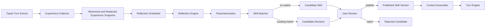

# Catio Agent 反思与技能演进设计

> 日期：2026-08-15  
> 状态：设计讨论已确认，书面设计待用户复核  
> 关联研究：[`small-rust-hermes-v3-analysis.md`](../../research/small-rust-hermes-v3-analysis.md)

## 1. 目标

Catio 应能从用户实际解决问题的过程中沉淀经验，例如数据库巡检、服务器巡检、产品安装和故障处置。系统通过异步反思识别可复用流程，生成候选技能；候选必须经过用户审核和发布，之后才能被 Agent 检索和使用。

设计必须同时满足：

- 自动发现与用户手动触发并存。
- 反思不阻塞当前 Agent turn，也不改变当前执行结果。
- 技能可跨目标复用，也可安全地限制在单个目标。
- 发布技能不等于授予工具执行权限。
- 每次生成、审核、发布、执行和修订都可解释、可审计、可回滚。
- 关闭反思和技能注入后，基础 turn engine 行为不变。

## 2. 非目标

本设计不允许 Agent 静默创建或修改已发布技能，不允许一次成功经历直接获得永久执行权限，也不把未验证的故障处理过程当作可靠技能。第一阶段不实现多 Agent 互相改写技能、无审核的自主进化、跨用户技能市场或基于原始 reasoning 的长期训练。

## 3. 已确认的产品决策

1. 候选技能必须由用户审核后发布。
2. 采用混合触发：系统主动建议沉淀，用户也可手动发起。
3. 技能同时支持通用作用域和目标专属作用域。
4. 发布只认可技能内容，不授予其中命令或工具的执行权限。
5. 采用异步反思管线；手动触发复用同一管线。
6. 相似经验优先生成已有技能的候选修订，而不是不断创建重复技能。
7. 反思、自我进化的准确含义是受控的“技能演进”，不是 Agent 自主改写运行时行为。

领域术语以仓库根目录 [`CONTEXT.md`](../../../CONTEXT.md) 为准。

## 4. 总体架构

### 4.1 Experience Collector

监听 Rust turn engine 的 typed events，在 turn 结束后形成最小化、已脱敏且不可变的 `ExperienceSnapshot`。快照包含 owner、目标、turn、工具步骤、终态、验证证据和必要的输出摘要；不保存完整 reasoning，也不默认复制完整终端或查询结果。

Collector 只记录事实，不判断是否应该创建技能。快照必须使用当时的事件版本，后续会话编辑不能改变反思输入。

### 4.2 Reflection Scheduler

负责两种触发来源：

- 自动触发：turn 明确完成、存在验证证据，并且过程具有潜在复用价值。
- 手动触发：用户在 Agent、历史或技能界面选择“沉淀为技能”。

Scheduler 创建异步 job，不阻塞 `TurnFinished`。相同 turn、相同事件版本只创建一个 active job；失败 job 可以重试，但不能产生重复候选。

### 4.3 Reflection Engine

从脱敏后的快照生成结构化 `ReflectionReport`，至少回答：

- 遇到了什么问题或目标。
- 根因或关键约束是什么。
- 哪些步骤真正促成了成功。
- 成功如何得到验证。
- 哪些条件可以泛化，哪些只能绑定当前目标。
- 复用时存在哪些风险、前置条件与回滚方法。

Reflection Engine 默认是只读的：不能执行工具、修改会话、发布技能或修改已有技能。模型失败只会令 reflection job 失败，不影响原 turn。

### 4.4 Redaction and Parameterization

最小化和 secret redaction 在持久化 ExperienceSnapshot 以及调用 Reflection Engine 之前完成；密码、token、私钥、连接串及疑似 secret 不得写入快照、模型请求或候选。原始输出仅保留必要摘要和受权限保护的事件引用。

ReflectionReport 生成后，主机名、地址、端口、路径、数据库名和产品版本等会尝试转换为 typed parameters。如果参数化会丢失关键安全语义，候选必须降为目标专属，而不是强行形成通用技能。

### 4.5 Skill Matcher

对当前用户可见、作用域兼容的已发布技能进行匹配。匹配结果包含候选、相似度和命中理由：

- 没有足够相似的技能时生成 `CandidateSkill`。
- 匹配已有技能时生成 `CandidateRevision`，保存基准版本并展示结构化 diff。
- 多个技能高度相似时不自动合并，由用户选择目标技能或保留新技能。

匹配算法可以从关键词与结构字段开始，后续增加 embedding；算法升级不能改变候选必须审核的边界。

### 4.6 Skill Publisher

审核操作包括编辑、发布、拒绝和合并。发布创建新的不可变技能版本，并记录候选来源、审核人、时间、内容哈希和基准版本。

若审核期间基准技能已产生新版本，发布必须返回 version conflict，要求基于最新版本重新生成 diff 或人工合并。拒绝的候选保留最小审计记录，但不会进入检索结果。

### 4.7 Context Assembler

只有 `PublishedSkill` 能被 Context Assembler 检索。Assembler 根据 owner、目标、用户选择和命中理由构造本 turn 的不可变知识快照，并将实际使用的技能 ID 与版本写入 turn 审计。

Turn engine 只消费已装配的快照，不负责技能 CRUD、反思、检索和自动写入。这样桌面与 server mode 可以共享相同执行语义。

## 5. 领域模型与状态

### 5.1 ExperienceSnapshot

核心字段包括：`owner_id`、`session_id`、`turn_id`、`target_ref`、`event_version`、`outcome`、步骤摘要、验证证据、脱敏标记和创建时间。`outcome` 至少区分 completed、failed、cancelled 与 outcome-unknown。

### 5.2 ReflectionReport

包含问题、原因、有效步骤、无效尝试、验证、可迁移条件、风险、建议作用域和来源引用。它是分析结果，不是可执行技能。

### 5.3 SkillCandidate

候选内容至少包含：

- 名称、用途、触发条件和建议标签。
- `global` 或 `target-specific` 作用域。
- 前置条件和 typed parameters。
- 有序步骤及预期使用的 tools。
- 风险、验证步骤和可用时的回滚方案。
- 来源 turn、脱敏证据、生成原因与匹配理由。
- `candidate / rejected / published` 状态。

自动反思只有在存在成功验证证据时才能创建普通候选。手动触发允许生成 `evidence-insufficient` 候选，但发布前必须补充验证步骤，或由用户明确确认风险并留下审计记录。

### 5.4 SkillVersion

已发布版本不可变，包含 skill ID、version、内容、作用域、内容哈希、来源 candidate、审核信息和前一版本引用。回滚通过重新激活旧版本或发布恢复版本完成，不直接改写历史版本。

## 6. Skill 与 Memory 的边界

四类相邻数据保持独立：

| 类型 | 含义 | 是否可进入 Agent 上下文 | 是否包含可执行流程 |
|---|---|---|---|
| 片段 | 用户显式保存、可插入终端的命令或 SQL | 用户主动选择时 | 单段内容，不保证完整流程 |
| 历史 | 已发生的终端、SQL 或 Agent 活动 | 默认不自动注入 | 否 |
| 记忆 | 事实、偏好、问题案例和结果 | 可按策略检索 | 否 |
| 技能 | 经审核的可复用操作流程 | 仅已发布版本 | 是 |

失败、取消或结果未知的经历可以形成问题记忆，供未来关联，但不能自动成为技能。记忆也不能因为被多次命中就自动升级为技能；它必须经过同一反思和审核流程。

## 7. UI 设计

在现有 `IconRail` 顶部区域新增“技能”和“记忆”，与“片段库”“历史”平级。两者各自使用独立 panel，并继续遵守当前主题变量和 i18n 机制。

`SkillsPanel` 至少包含：

- 已发布：查看、搜索、禁用、查看版本、回滚和手动新建。
- 待审核：显示数量 badge，查看候选或候选修订。
- 审核详情：来源、证据、参数、作用域、风险、验证、版本 diff，以及编辑、发布、拒绝和合并操作。

自动反思产生候选后，以非阻塞通知提示用户；不会自动打开面板。Agent 消息、历史记录和技能面板都可提供“沉淀为技能”的手动入口，最终进入同一 review queue。

每个 Agent turn 应能展示实际采用的技能名称与版本，并解释自动命中原因。用户可以在发送前固定、排除或关闭自动技能注入。

## 8. 权限与安全

- 发布技能只表示认可内容，不表示授予工具权限。
- 每次执行仍经过 tool policy、敏感命令确认、owner/target scope 和 resource lease。
- Skill 不能保存明文 secret，也不能要求模型从记忆中还原凭据。
- Reflection Engine 消费最小化快照，不消费未筛选的跨用户数据。
- 通用技能只能在参数和工具 scope 与当前目标兼容时命中。
- 目标专属技能不得被另一个目标或用户检索。
- 来自工具输出的文本始终视为不可信数据，不能通过反思内容改变系统指令或审核规则。
- reflection、candidate、publication 和 skill-use 事件进入审计日志；完整敏感输出不进入长期审计。

## 9. 错误与并发处理

- Reflection job 失败：记录可重试错误，不影响原 turn，不创建半成品候选。
- 模型输出不符合 schema：修复重试达到上限后失败，不能降级为自由文本技能。
- Secret redaction 不确定：标记候选需要人工检查，自动通知中不展示疑似 secret。
- 基准 Skill 发生并发更新：返回 version conflict，不覆盖新版本。
- 目标已删除：目标专属候选保留但不可发布，直到重新绑定或转为通用技能。
- 用户关闭反思：停止创建新自动 job；已有候选仍可审核，正在运行的 job 请求取消。
- 用户关闭技能注入：已发布技能仍保留，但 Context Assembler 不向新 turn 注入。

## 10. 验证策略

### 单元测试

- 候选、修订、发布、拒绝和版本冲突状态转换。
- 自动与手动触发的去重和幂等。
- secret redaction、参数化和作用域降级。
- 已验证、失败、取消和 outcome-unknown 的资格判定。
- Skill matching 的新建、修订和多匹配分支。

### 集成测试

- scripted turn events 产生稳定的 ExperienceSnapshot 和 ReflectionReport。
- 成功巡检或安装流程形成候选，审核后才可被 Context Assembler 检索。
- 发布前后工具权限结果完全一致。
- 修订候选展示正确 diff，过期基准无法覆盖新版本。
- 不同 owner、主机和数据库连接之间完全隔离。
- 关闭反思或技能注入后，基础 turn engine 输出与未启用功能时一致。

### 质量 fixtures

建立数据库巡检、服务器巡检、产品安装、已解决故障、未解决故障和含 secret 输出等固定 fixtures。每个 fixture 断言候选是否应产生、作用域、参数、验证步骤、风险和脱敏结果，防止模型或 prompt 更新导致技能质量静默回退。

## 11. 分阶段交付

1. 完成 provider-neutral Rust turn engine 和可重放 typed events。
2. 增加 Skills/Memory 平级入口与带 owner scope 的 Repository。
3. 实现手动反思，打通快照、脱敏、查重、审核和发布。
4. 接入异步自动触发、通知和失败重试。
5. 增加候选修订、合并、版本回滚和命中解释。
6. 使用质量 fixtures 评估后，再逐步优化自动触发和匹配算法。

每个阶段均可独立关闭；后续阶段不得改变前一阶段的执行权限语义。

## 12. 成功标准

- 用户解决一个经过验证的问题后，系统能异步提出高质量、已脱敏的候选技能。
- 用户可在统一审核界面编辑、拒绝、合并或发布候选。
- 只有明确发布的版本会参与 Agent 检索。
- 相似经历形成候选修订，不造成大量重复技能。
- 通用与目标专属技能不会越过 owner/target 边界。
- 任意技能的来源、版本、审核和实际使用都可追溯。
- 系统可以持续积累经验，同时没有静默修改能力和隐式权限升级。
